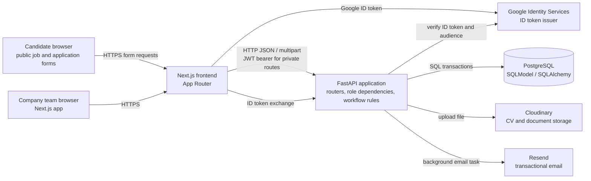
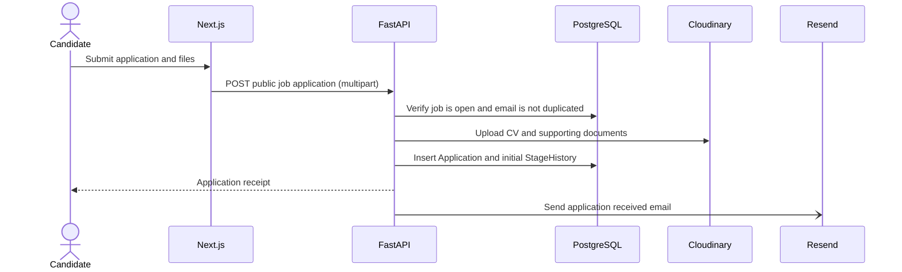

# HireDesk ERD and Architecture

- **Status:** Draft, as-built baseline
- **Date:** 2026-10-09
- **Related:** [PRD](../../specs/prd-hiredesk.md); [SRS](../../specs/srs-hiredesk.md)

## 1. System Context

HireDesk is a browser-based hiring workspace. The Next.js frontend calls a FastAPI backend. The backend owns authentication, authorization, workflow transitions, validation, and persistence. PostgreSQL is the system of record. Cloudinary and Resend are optional external adapters for document storage and email delivery; Google Identity Services is an optional identity provider.



Google verification is performed by the backend using the configured OAuth client ID. The frontend client ID is public configuration; the backend is responsible for validating the issued ID token and verified email claim. Password authentication uses backend-issued bearer JWTs as well.

## 2. Entity Relationship Diagram

```mermaid
erDiagram
    COMPANIES {
        uuid id PK
        string name
    }

    USERS {
        uuid id PK
        uuid company_id FK
        string email UK
        string full_name
        string hashed_password
        enum role
    }

    JOBS {
        uuid id PK
        uuid company_id FK
        uuid hiring_manager_id FK "nullable"
        string title
        string description
        string qualification_requirements
        int salary_min "nullable"
        int salary_max "nullable"
        enum status
        timestamptz created_at
    }

    APPLICATIONS {
        uuid id PK
        uuid job_id FK
        string full_name
        string email
        string phone
        string cv_url
        string candidate_qualifications
        int expected_salary "nullable"
        int match_score "nullable 0-100"
        string manager_notes "nullable"
        string interviewer_recommendation "nullable"
        json supporting_documents
        string cover_letter "nullable"
        enum stage
        timestamptz created_at
    }

    STAGE_HISTORY {
        uuid id PK
        uuid application_id FK
        enum from_stage "nullable for application receipt"
        enum to_stage
        uuid changed_by_id FK "nullable for public submission"
        timestamptz changed_at
    }

    INTERVIEWS {
        uuid id PK
        uuid application_id FK
        uuid interviewer_id FK
        timestamptz starts_at "nullable until scheduled"
        timestamptz ends_at "nullable until scheduled"
        enum status
        enum meeting_type "nullable until scheduled"
        string meeting_url "nullable"
        string location "nullable"
    }

    SCORECARDS {
        uuid id PK
        uuid interview_id FK_UK
        enum status
        enum recommendation "nullable"
        timestamptz submitted_at "nullable"
    }

    SCORECARD_RATINGS {
        uuid scorecard_id PK_FK
        string criterion PK
        int rating "1-5"
        string comment "nullable"
    }

    INVITATIONS {
        uuid id PK
        uuid company_id FK
        uuid invited_by_id FK
        string email
        string full_name
        enum role
        string token_hash UK
        timestamptz expires_at
        timestamptz accepted_at "nullable"
        timestamptz created_at
    }

    COMPANIES ||--o{ USERS : owns
    COMPANIES ||--o{ JOBS : owns
    COMPANIES ||--o{ INVITATIONS : issues
    USERS o|--o{ JOBS : manages
    USERS ||--o{ INVITATIONS : invites
    JOBS ||--o{ APPLICATIONS : receives
    APPLICATIONS ||--o{ STAGE_HISTORY : records
    USERS o|--o{ STAGE_HISTORY : changes
    APPLICATIONS ||--o{ INTERVIEWS : has
    USERS ||--o{ INTERVIEWS : conducts
    INTERVIEWS ||--|| SCORECARDS : has
    SCORECARDS ||--o{ SCORECARD_RATINGS : contains
```

## 3. Relationship and Integrity Notes

- **Company isolation:** `users`, `jobs`, and `invitations` reference `companies`. Applications inherit company scope through `applications.job_id -> jobs.company_id`; there is no direct `company_id` on an application.
- **Candidate representation:** There is no `Candidate` or candidate-user table. Candidate identity/contact data is captured on each `Application`; one person may have separate application rows for different jobs.
- **Application uniqueness:** PostgreSQL enforces unique `(job_id, email)` so one email cannot apply twice to the same job.
- **Manager assignment:** `jobs.hiring_manager_id` is nullable in storage, but new jobs are assigned to the creating hiring manager by the API.
- **Stage history:** Initial public submission creates a history row with `from_stage = NULL` and `changed_by_id = NULL`; later transitions record the current user.
- **Interview scheduling:** An interview is first assigned with no time. Scheduling adds the start/end and meeting details. A PostgreSQL exclusion constraint prevents overlapping scheduled intervals for the same interviewer; cancelled rows do not occupy a time slot.
- **Scorecard cardinality:** One scorecard exists per interview. Its ratings are child rows keyed by `(scorecard_id, criterion)`; rating values are restricted to 1-5.
- **Invitation secrecy:** Invitation records store a hash of the invite token, not the raw bearer token returned in the invitation URL.
- **JSON documents:** Supporting-document name/URL metadata is stored in the application's JSON field. Binary document content lives in Cloudinary.
- **Assessment storage:** The hiring-manager assessment is stored directly on `applications.match_score` and `applications.manager_notes`, not as a separate assessment entity.
- **Recommendation storage:** Individual interviewer recommendation is stored on `scorecards.recommendation`; `applications.interviewer_recommendation` is a computed workflow summary persisted on the application.

## 4. Application Architecture

### Frontend
- Next.js App Router, React, TypeScript, and Tailwind CSS.
- Public routes support job application and auth pages; protected routes provide overview, jobs, candidates, interviews, and team workflows.
- A shared API client attaches the JWT bearer token and clears the local session after an authenticated `401`.
- Auth session state is held in the frontend auth store; server authorization remains authoritative.

### Backend
- FastAPI route modules are organized by authentication, users, companies, jobs, candidates, interviews, and scorecards.
- Pydantic schemas validate request and response contracts.
- Authentication dependencies validate bearer tokens and load the user; role dependencies gate write operations.
- Shared visibility queries enforce company and resource scope. Domain functions enforce stage transitions and other workflow constraints.
- SQLModel models map to PostgreSQL; Alembic owns schema evolution.
- FastAPI background tasks dispatch email work after request handling. Email failure is logged rather than returned as a failed business transaction.

### External systems

| System | Responsibility | Configuration / failure behavior |
|---|---|---|
| Google Identity Services | User authentication and ID token issuance. | Optional; frontend and backend use the same web client ID; backend rejects auth when disabled or missing the ID. |
| Cloudinary | Store uploaded CVs and supporting documents. | Required for candidate file intake; absent configuration returns service unavailable. |
| Resend | Send invitation, candidate, interviewer, and company-admin emails. | Optional in development; when unset, the API flow continues and a warning is logged. |
| PostgreSQL | Durable business data and concurrency constraints. | Required; managed through Alembic migrations. |

## 5. Key Workflows

### Candidate application and hiring



### Interview and scorecard

```mermaid
sequenceDiagram
    actor Manager as Hiring manager
    actor Interviewer
    actor Candidate
    participant API as FastAPI
    participant DB as PostgreSQL
    participant Mail as Resend

    Manager->>API: Assign interviewer to application
    API->>DB: Insert Interview and pending Scorecard
    API-)Mail: Notify interviewer
    Interviewer->>API: Set future time, type, and meeting details
    API->>DB: Enforce no overlapping scheduled time
    API-)Mail: Send candidate meeting details
    Interviewer->>API: Submit ratings and recommendation
    API->>DB: Lock and finalize Scorecard; mark Interview completed
    API->>DB: Update application recommendation summary
    Manager->>API: Record assessment and final decision
    API-)Mail: Notify company admins and candidate as applicable
```

## 6. Authorization Matrix

| Resource/action | Company admin | Hiring manager | Interviewer | Public candidate |
|---|---|---|---|---|
| List/read company jobs | Yes | Own assigned jobs | No | Open job detail only |
| Create/update job | No | Yes, for own scope | No | No |
| List/read applications | No | Own assigned jobs | Assigned active applications | No |
| Submit application | No | No | No | Yes, for open jobs |
| Assign/cancel interview | No | Yes, in own scope | No | No |
| Schedule interview | No | No | Own assigned interview | No |
| Submit scorecard | No | No | Own scheduled interview | No |
| Read all visible scorecards/aggregate | No application access | Yes | No aggregate; privacy-limited records | No |
| Invite/list team | Invite: yes; list: yes | Invite: no; list: yes | No | No |
| Final assessment/decision | No | Yes | No | No |
| Assessment and hire notification | Receives company email | Performs action | No | Receives candidate email for updates |

## 7. Deployment and Configuration View

Configuration is supplied by environment variables and ignored local `.env` files:
- Frontend: `NEXT_PUBLIC_API_URL`, optional `NEXT_PUBLIC_GOOGLE_CLIENT_ID`.
- Backend: `DATABASE_URL`, `JWT_SECRET`, `FRONTEND_BASE_URL`, `CORS_ORIGINS`, optional `GOOGLE_AUTH_ENABLED` and `GOOGLE_CLIENT_ID`, Cloudinary settings, and Resend settings.

The frontend client ID is intentionally public. Do not place Google client secrets, database passwords, JWT keys, or provider secrets in `NEXT_PUBLIC_*` variables.

## 8. Known Gaps and Decisions

- First-time Google auth creates a new company-admin account. It does not match or consume pending invitations; invited-user Google account linking needs a defined policy and implementation.
- No explicit foreign-key cascade policy or company/user deletion workflow is present in the schema contract.
- No retention lifecycle for Cloudinary files or candidate data is defined.
- Production topology, secret manager, TLS termination, backups, observability, and service-level objectives are not specified in the repository.
- Current local API operation may require an environment-specific database URL; keep development and test databases separate.
